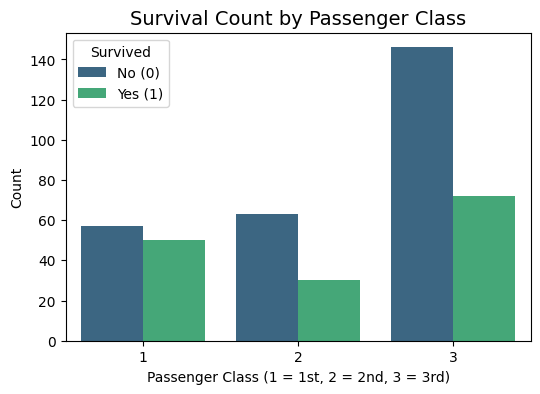
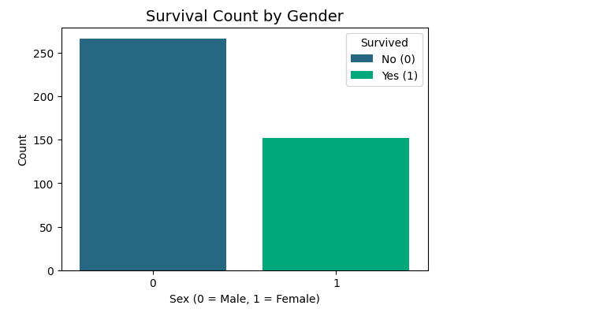
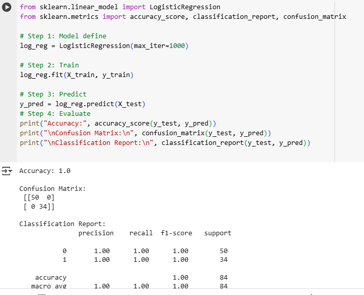
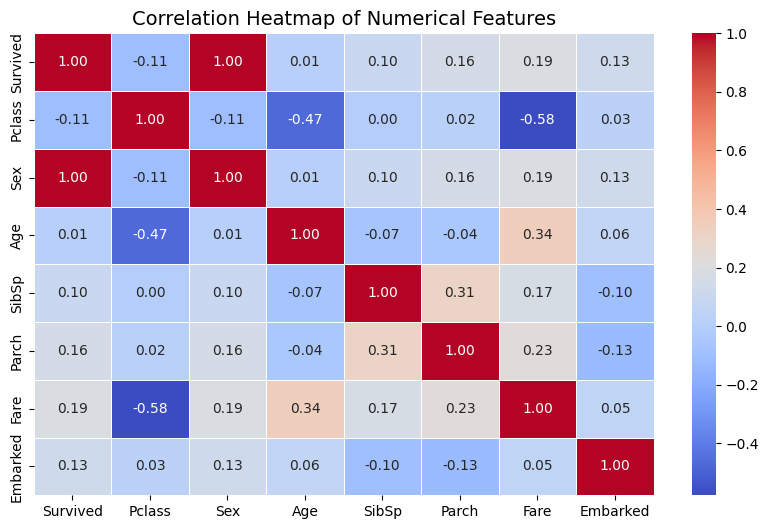

# Titanic_Survival-prediction-system-using-ML

This project predicts whether a passenger survived the Titanic disaster using Machine Learning models.  
The dataset used is the famous [Titanic dataset](https://www.kaggle.com/c/titanic).  

---

## 📊 Project Workflow

### 1. Data Preprocessing
- Handled missing values:
  - Filled `Age` and `Fare` with median values
  - Dropped `Cabin` due to excessive missing data
- Encoded categorical variables:
  - `Sex`: male → 0, female → 1
  - `Embarked`: S → 0, C → 1, Q → 2
- Dropped unnecessary columns: `PassengerId`, `Name`, `Ticket`

### 2. Exploratory Data Analysis (EDA)
- Survival distribution (overall and gender-wise)
- Passenger class survival rates
- Age and Fare distributions
- SibSp (siblings/spouses) and Parch (parents/children) impact
- Correlation heatmap and pair plots

### 3. Model Training
Implemented and evaluated three machine learning algorithms:
- **Logistic Regression**
- **Decision Tree Classifier**
- **Random Forest Classifier** (best performance)

### 4. Model Saving
- Trained Random Forest model saved as `titanic_model.pkl` using `joblib`.

---

## 🛠️ Technologies Used
- **Python**
- **Pandas, NumPy** → Data preprocessing  
- **Matplotlib, Seaborn** → Data visualization  
- **Scikit-learn** → Machine learning models & evaluation  
- **Joblib** → Model persistence 

### 5. Screen Shots

### Model Accuracy
## 📸 Project Screenshots  

### 1. Passenger Class vs Survival

### 2. Gender-wise Survival

### 3. Accuracy Report

### 4. Feature Correlation Heatmap

